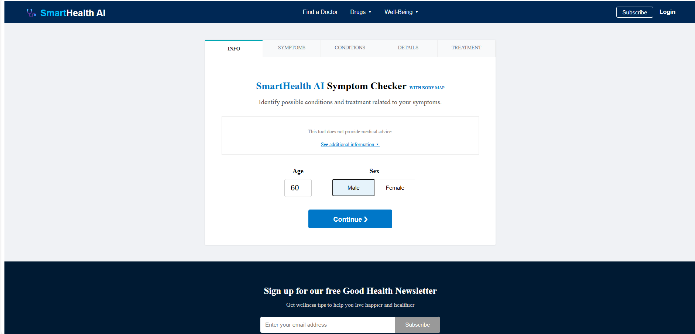
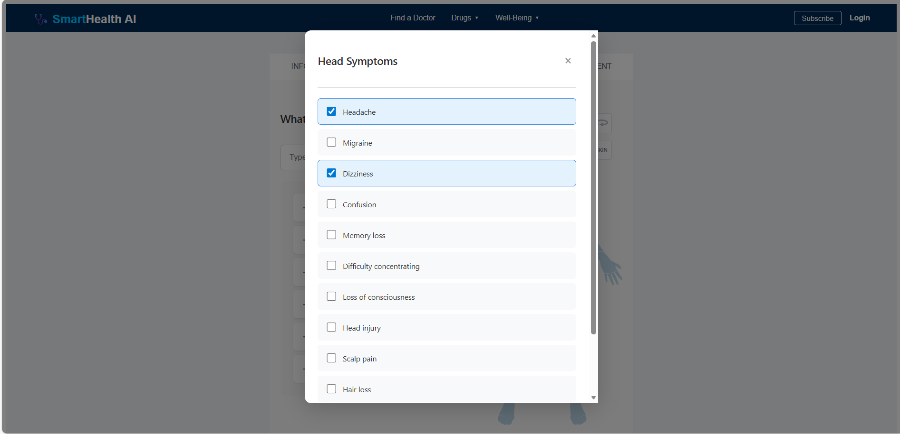
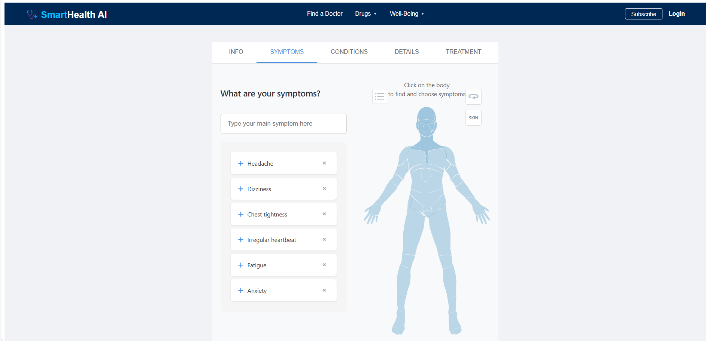
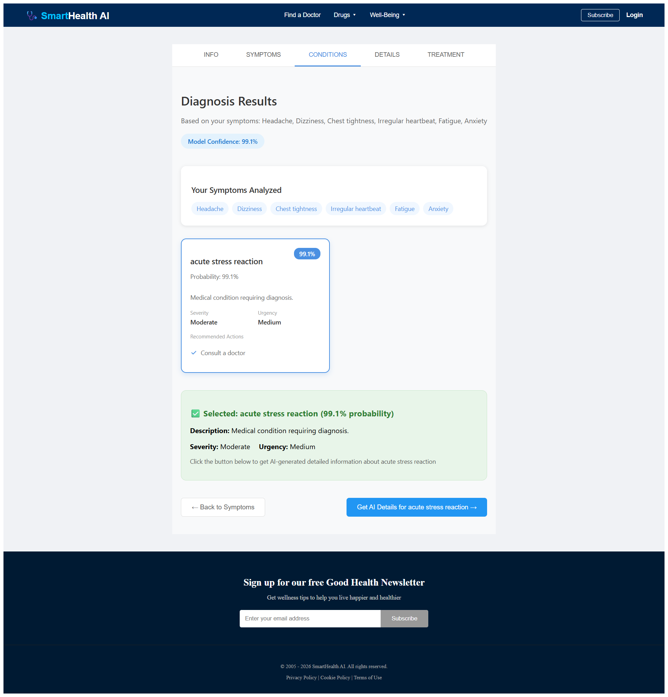
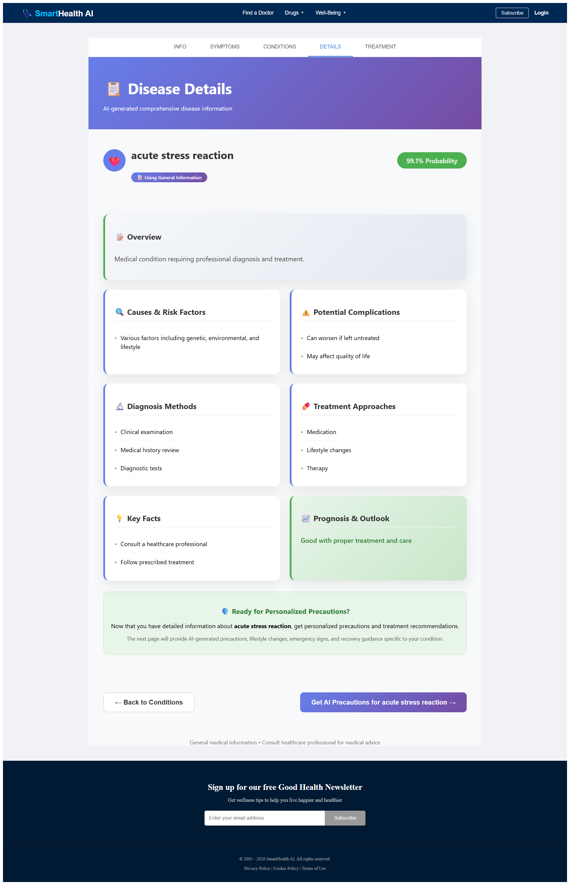
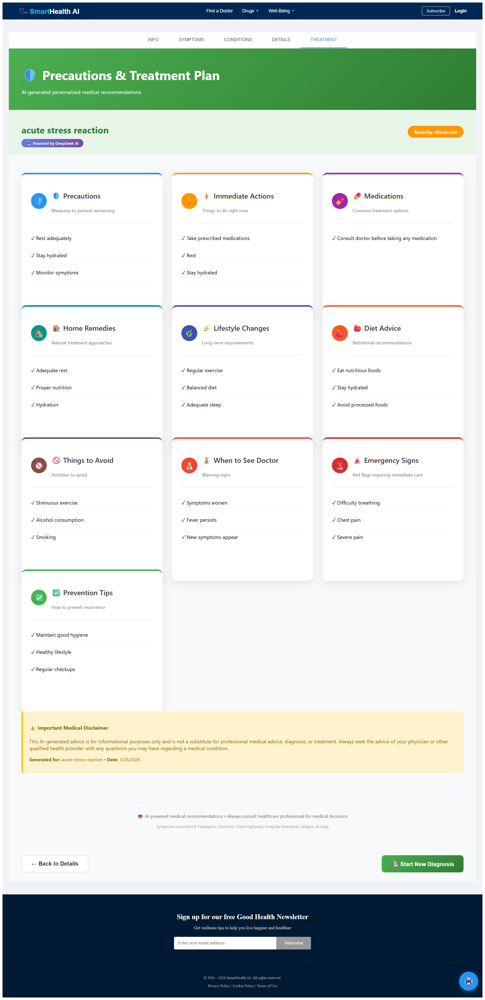

# 🧠 SmartHealth AI – Disease Prediction System

An AI-powered web application that predicts possible diseases based on user-selected symptoms using Machine Learning.

## 🚀 Features
* 🧍 **User inputs age & gender**
* 🧠 **Symptom-based disease prediction**
* 📊 **Confidence score for predictions**
* ⚡ **Fast API using Flask**
* 💻 **Interactive frontend built with React**
* 🗂 **Scalable architecture (MERN + ML)**

---

## 📸 Screenshots

### 1. Homepage & Patient Details

### 2. Symptom Selection (List & Body Map)

### 3. AI Diagnosis Results

### 4. Comprehensive Disease Details

### 5. Personalized Precautions & Treatment

---

## 🏗️ Tech Stack
* **Frontend:** React.js
* **Backend:** Flask (Python)
* **Machine Learning:** Scikit-learn, Stacking/Ensemble Models

---

## ⚙️ Setup Instructions

### 1️⃣ Clone Repository
    git clone https://github.com/your-username/your-repo-name.git
    cd your-repo-name

### 2️⃣ Backend Setup (Flask)
Navigate to the backend folder:
    cd backend

Create a virtual environment:
[Windows]
    python -m venv venv
    venv\Scripts\activate

[Mac/Linux]
    python3 -m venv venv
    source venv/bin/activate

Install required Python packages:
    pip install flask flask-cors scikit-learn numpy joblib

Run the backend server:
    python app.py

(Backend will run on: http://127.0.0.1:5000)

### 3️⃣ Frontend Setup (React)
Open a new terminal and navigate to the frontend folder:
    cd frontend

Install dependencies:
    npm install

Start the React development server:
    npm start

(Frontend will run on: http://localhost:3000)

---

## 4️⃣ How to Use
1. Open the frontend in your browser (http://localhost:3000).
2. Enter your age and gender on the homepage.
3. Select symptoms by clicking on the body map.
4. Submit to see predicted diseases with a confidence score.

---

## 5️⃣ Notes
* ⚠️ Make sure the backend is running before using the frontend.
* 📁 Keep your .pkl model files inside the backend folder.
* 🖼️ Make sure to place your UI images in an `assets` folder in the root directory so the screenshots show up!
* 🐛 If using Windows and getting errors, check that your virtual environment is properly activated.
